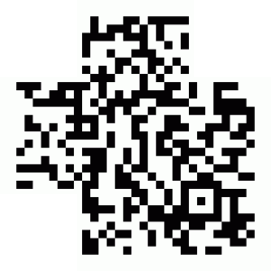

# Quick Response Code
## 40 Points
### Retrouver le flag de validation

## Énoncé
Décodez l’image et renvoyez le flag en moins de 6 secondes.

## Solution

Quand on lance le challenge, on arrive sur une page simple avec une image de ce qui semble être un QR Code, un input et 1 bouton. On suppose donc qu'il faut réussir à décoder le QR Code puis l'envoyer avec l'input. Mais on sait très bien que ce n'est pas possible car comme dit dans la consigne du challenge, on a que 6 secondes. On va donc faire un script qui va faire tout ça.

En premier il nous faut un début de code qui récupère le QR Code:
```Python
import requests
import re
import base64
import cv2


url = 'http://challenge01.root-me.org/programmation/ch7/'

s = requests.get(url)

session = s.cookies
match = re.search(r';base64,(.*?)\"', s.text)
img_data = base64.b64decode(match.group(1))

f = open('image.png', 'wb')
f.write(img_data)
f.close()
```

En suite, il nous faut du code pour lire la value coder dand le QR Code afin de l'envoyer avec une requête POST:

```Python
image_path = './image.png'

def decode_qr_code(image_path):
    # Read the image
    image = cv2.imread(image_path)

    # Initialize the QRCode detector
    qr_code_detector = cv2.QRCodeDetector()

    # Detect and decode the QR code
    value, pts, qr_code_data = qr_code_detector.detectAndDecode(image)

    # Check if a QR code was detected
    if value:
        print(f'Data: {qr_code_data}')
        print(f'Points: {pts}')
        print(f'value: {value}')
        return value
    else:
        print('No QR code detected.')

res = decode_qr_code('./new.png')
```

Mais le problème est que lorsqu'on fait cela, le QR Code ne se fait pas reconnaitre, ce qui est normal, on voit bien qu'il manque quelque chose à ce QR Code.



On va donc changer l'image pour faire en sorte que le QR Code soit lisible dans l'objectif de pouvoir décoder:

```Python
def top_left(image):

    big_square = (20, 20)
    small_square = (35, 35)

    big_square_size = 58
    small_square_size = 30

    color = (0, 0, 0)

    cv2.rectangle(image, big_square, (big_square[0] + big_square_size, big_square[1] + big_square_size), color, 8)
    cv2.rectangle(image, small_square, (small_square[0] + small_square_size, small_square[1] + small_square_size), color, -1)

def top_right(image):

    big_square = (image.shape[1] - 22, 20)
    small_square = (image.shape[1] - 35, 35)

    big_square_size = 58
    small_square_size = 30

    color = (0, 0, 0)

    cv2.rectangle(image, (big_square[0] - big_square_size, big_square[1]), (big_square[0], big_square[1] + big_square_size), color, 8)

    cv2.rectangle(image, (small_square[0] - small_square_size, small_square[1]), (small_square[0], small_square[1] + small_square_size), color, -1)

def bottom_left(image):

    big_square = (20, image.shape[0] - 20)
    small_square = (35, image.shape[0] - 34)

    big_square_size = 58
    small_square_size = 30

    color = (0, 0, 0)

    cv2.rectangle(image, big_square, (big_square[0] + big_square_size, big_square[1] - big_square_size), color, 8)

    cv2.rectangle(image, small_square, (small_square[0] + small_square_size, small_square[1] - small_square_size), color, -1)

def correct_qr_code(image_path, output_path):
    image = cv2.imread(image_path)

    top_right(image)
    top_left(image)
    bottom_left(image)

    cv2.imwrite(output_path, image)

correct_qr_code(image_path, 'new.png')
```

On à donc un QR Code lisible, et donc notre code va marcher et décoder le QR Code, on peut donc l'envoyer dans la requête POST et récupérer le flag !


```Bash
value: The key is /qrcod_ekNHq0
Status Code: 200
Response Content:
<html><head></head><body><link rel='stylesheet' property='stylesheet' id='s' type='text/css' href='/template/s.css' media='all' /><iframe id='iframe' src='https://www.root-me.org/?page=externe_header'></iframe><p><p>Congratz, le flag est [censorship]
</p></p><br/></body></html>
```
